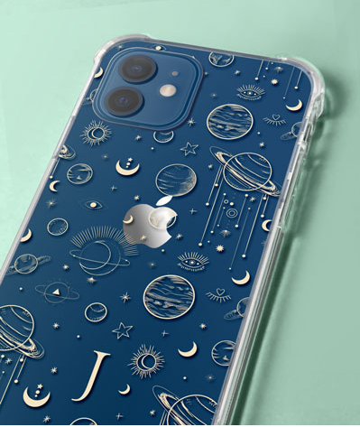
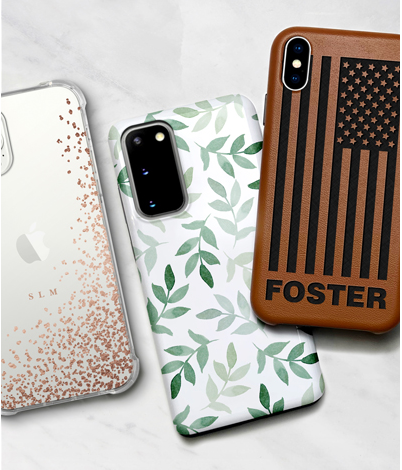

<!DOCTYPE html>
<html lang="en">

<head>
    <meta charset="utf-8" />
    <meta name="viewport" content="width=device-width, initial-scale=1" />

    <!-- Bootstrap CSS -->
    <link rel="stylesheet" href="node_modules/bootstrap/dist/css/bootstrap.min.css" />
    <link rel="stylesheet" href="https://fonts.googleapis.com/css?family=Lobster|Open+Sans" />
    /<link rel="stylesheet" href="css/deviceful.css" />
    <link rel="stylesheet" href="node_modules/font-awesome/css/font-awesome.min.css" />
    <title>Deviceful Designs</title>
    <style>
    body {
    font-family: "Open Sans", sans-serif;
}

h1, h2, h3 {
    font-family: "Lobster", cursive;
}

h2 {
    color: black;
}

header h2 {
    color: #CEC8FF;
}

footer{
    background-image: linear-gradient(blue,white);
    padding: 20px 0;
}

.jumbotron {
    margin: 0;
    padding: 30px;
    background-image: linear-gradient(white,blue);
    color: rgb(17, 17, 17);
    text-align: center;
}
.row-content {
    padding: 50px 0;
    border-bottom: 1px ridge;
    min-height: 200px;
}

.navbar {
    background-color: #140970;
}

.tab-content {
    border: 1px solid #DDD;
    border-top: none;
    padding: 10px;
}

.carousel-caption {
    background-color: rgba(0, 0, 0, 0.5);
}

.carousel {
    border: solid #5637DD;
}

h5 {
    color: black;
}

background {
    background-color: #140970 ;
}
</script>
</head>

<body>
    <header class="jumbotron jumbotron-fluid">
        

            

                <h5 style="text-align: left;">Your case </h5>
                <h5 style="text-align: right;"> your way</h5>
                

                     <h1 style="font-size: 500 PX;">Deviceful Designs</h1>
                

            

        

    </header>
    <nav class="navbar navbar-expand-sm navbar-dark sticky-top">
        

            <button class="navbar-toggler" type="button" data-toggle="collapse" data-target="#nucampNavbar">
             <button class="navbar-toggler" type="button" data-toggle="collapse" data-target="#nucampNavbar">
                 
             </button>
             

                 <ul class="navbar-nav">    
                     <ul class="navbar-nav">
                        <li class="nav-item "><a class="nav-link" href="index.html"><i class="fa fa-home fa lg"></i>Home</a></li>
                        <li class="nav-item "><a class="nav-link" href="contactus.html"><i class="fa fa-address-card fa lg"></i>Contact</a></li>
                        <li class="nav-item "><a class="nav-link" href="Shop.html"><i class="fas fa-store"></i>Store</a></li>
                     </ul>
                 </ul>
             

        

    </nav>

    

        

            

                

                    <ol class="carousel-indicators">
                        <li data-target="#homeCarousel" data-slide-to="0" class="active"></li>
                        <li data-target="#homeCarousel" data-slide-to="1"></li>
                        <li data-target="#homeCarousel" data-slide-to="2"></li>
                    </ol>
                    

                        

                            
                            

                                <h3>clear Phone Cases</h3>
                            

                        

                        

                            
                            

                                <h3>Custom Ipad Cases</h3>
                            

                        

                        

                            
                            

                                <h3>Custom Photo Cases</h3>
                            

                        

                        

                            
                            

                                <h3>Leather Cases</h3>
                            

                        

                        

                            
                            

                                <h3>Designer Cases</h3>
                            

                        
 
                    

                    <a class="carousel-control-prev" href="#homeCarousel" role="button" data-slide="prev">
                        
                        Previous
                    </a>
                    <a class="carousel-control-next" href="#homeCarousel" role="button" data-slide="next">
                        
                        Next
                    </a>
                

            

        

    

    <footer>
        

            
             
                

                    <h5>Links</h5>
                    <ul class="list-unstyled">
                        <li class="nav-item "><a class="nav-link" href="index.html"><i class="fa fa-home fa lg"></i>Home</a></li>
                        <li class="nav-item "><a class="nav-link" href="contactus.html"><i class="fa fa-address-card fa lg"></i>Contact</a></li>
                    </ul>
                

                

                    <h5>Social</h5>
                    <a href="http://instagram.com/">Instagram</a>
                    <a href="http://facebook.com/">Facebook</a>
                    <a href="http://twitter.com/">Twitter</a>
                    <a href="http://youtube.com/">YouTube</a>
                

                

                    Email: mcdonnelljames44@gmail.com
                
                
           

        

    </footer>
    
    
    

</body>

</html>
